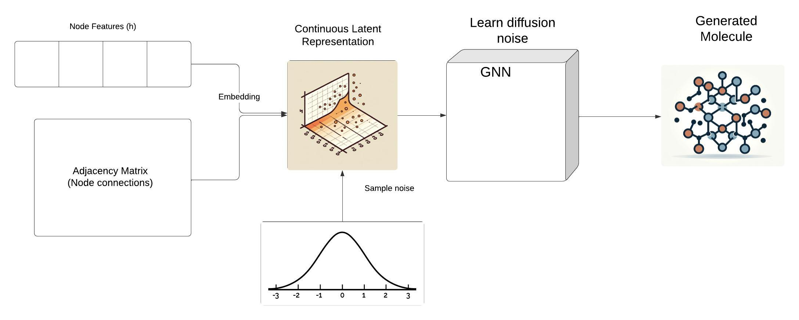

# Diffusion for Molecule Generation


This project explores the application of generative diffusion models for studying molecular data, with a specific focus on leveraging the QM9 dataset. This dataset comprises over 13,000 molecules represented using graph data structures, where each molecule is stored in graph data structure with nodes representing atoms and edges describing atomic bonds. This representation enables detailed chemical analysis and holds promise for discoveries in fields such as drug discovery and protein science. Previous research has investigated the potential of diffusion models in generating molecules [1], which serves as our primary inspiration.
Utilizing the [torch geometric library (PYG)](https://pytorch-geometric.readthedocs.io/en/latest/), this project explores the application of diffusion mechanism for molecules and for a broader applications of graph-based data generation.


## AutoEncoder

To transform the molecular graph data into a continuous latent space, we use an autoencoder. The encoder is a convolutional neural network that maps the molecular graph into a continuous latent space. The decoder is a convolutional neural network that maps the continuous latent space back to the molecular graph. The autoencoder is trained to minimize the reconstruction loss between the input molecular graph (adjacency matrix) and the output molecular graph.

## Model Archietecture

The backbone of our proposed generative diffusion model is the Graph Neural Network (GNN). This model is designed to possess the capability to learn molecular attributes and the interconnections between atoms within a molecule. Inspired by UNet in image generation, our model incorporates both "Up Sampling" and "Down Sampling" structures. Information extraction and graph message passing are facilitated by graph convolution layers [2]. 

### Model Pretrain
To pretrain the base model, use the following CLI command line:
```
python pretrain_gnn.py --configs configs
```
Training configurations can be modified in `configs.yaml`


## Diffusion
Our diffusion process is inspired by the DDPM work [3]. Since the atom features are discrete categorical features, the atom data is first embedded into a continuous latent space before applying Gaussian noise. This idea is inspired by [4], where text generation is embedded in a continuous latent space to provide continuous information before diffusion. 


### Diffusion model training
To train the diffusion model, use the following CLI command line:
```
python mole_diffuse.py --configs configs
```
Training configurations can be modified in `configs.yaml`

## Training Dataset

QM9 dataset consisting of about 130,000 molecules with 19 regression targets. Each molecule includes complete spatial information for the single low energy conformation of the atoms in the molecule. In our project, each node (atom) is represented in a categorical one hot vector of 5 classes- $H,C,N,O,F$.

## Generation
Our molecule generation process involves unconditioned diffusion, resulting in samples that are entirely data-driven and random. As demonstrated below, the generated results lack coherence within the context of real-world molecular science. Therefore, to achieve the generation of molecules that adhere to fundamental principles, it is imperative to incorporate conditions and background knowledge from quantum chemistry.

### Molecule samples generation
To generate molecule sample, run the following CLI command line:
```
python molecule_sampling.py --configs configs
```
Configurations can be modified in `configs.yaml`


## Reference
[1] Emiel Hoogeboom et al. Equivariant Diffusion for Molecule Generation in 3D. 2022. arXiv: 2203.17003 [cs.LG].

[2] Thomas N. Kipf and Max Welling. Semi-Supervised Classification with Graph Convolutional Net-
works. 2017. arXiv: 1609.02907 [cs.LG].

[3] Jonathan Ho, Ajay Jain, and Pieter Abbeel. Denoising Diffusion Probabilistic Models. 2020. arXiv:
2006.11239 [cs.LG].

[4] Xiang Lisa Li et al. Diffusion-LM Improves Controllable Text Generation. 2022. arXiv: 2205.14217
[cs.CL].

