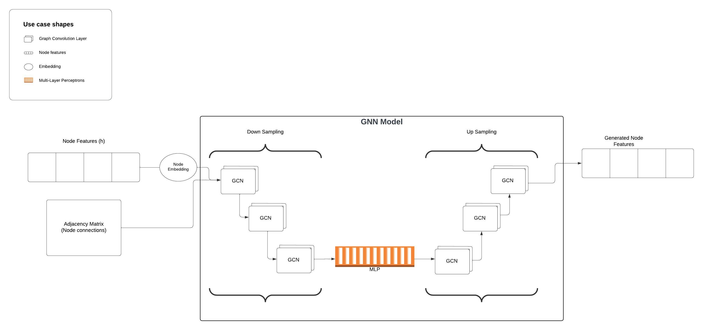
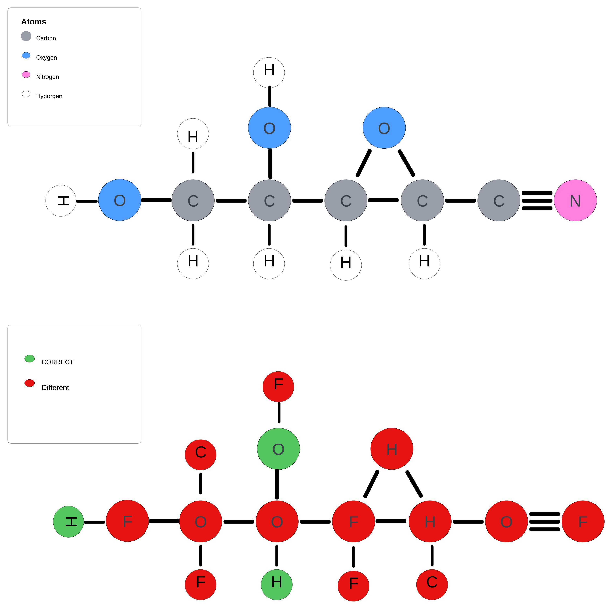

# Diffusion for Molecule Generation

This project delves into the application of generative diffusion model graph molecular data study, specifically leveraging the QM9 dataset—a collection of over 13,000 molecules described using graph data structures. Each molecule is represented as a graph with nodes corresponding to atoms and edges describing atomic bonds, facilitating detailed chemical analysis and potential discoveries in fields such as drug discovery and protein science. 
Utilizing the torch geometric library, this project explores the capabilities of Graph Convolutional Networks (GCNs) for processing molecular graphs. The primary focus is on adapting and refining generative diffusion models, specifically Denoising Diffusion Probabilistic Models (DDPM) and their derivatives, to enhance the generation and sampling of molecular structures. This involves a nuanced approach to data embedding and noise application, ensuring that categorical molecular features are aptly processed for generative tasks. Through extensive experimentation and iterative model refinement, this study aims to establish a robust framework that supports the efficient generation of molecular structures, thereby pushing the boundaries of how graph-based models contribute to scientific advancements in quantum chemistry.

## Model Archietecture

The backbone of our proposed generative diffusion model is Graph Neural Network (GNN). The model is designed to have the capability to learn the molecular attributes and the interconnections between atoms in a molecule. The model is inspired by UNet in image generation and contains "Up Sampling" and "Down Sampling" structure. The information extraction and graph message passing are driven by graph convolution layer [1]. 

## Diffusion
Our diffusion process is inspired by the work DDPM [2]. Since the atoms features are discrete categorical features, the atoms data is first embedded into a continuos latent space before applying Gaussian noise. The idea is inspired by the work [3], in which text generation is embedded in a continous latent space to provide continous information in before diffusion. 

## Training Dataset

QM9 dataset consisting of about 130,000 molecules with 19 regression targets. Each molecule includes complete spatial information for the single low energy conformation of the atoms in the molecule. In our project, each node (atom) is represented in a categorical one hot vector of 5 classes- $H,C,N,O,F$.

## Generation
Our molecule generation process involves unconditioned diffusion, resulting in samples that are entirely data-driven and random. As demonstrated below, the generated results lack coherence within the context of real-world molecular science. Therefore, to achieve the generation of molecules that adhere to fundamental principles, it is imperative to incorporate conditions and background knowledge from quantum chemistry.

## Reference
[1] Thomas N. Kipf and Max Welling. Semi-Supervised Classification with Graph Convolutional Net-
works. 2017. arXiv: 1609.02907 [cs.LG].

[2] Jonathan Ho, Ajay Jain, and Pieter Abbeel. Denoising Diffusion Probabilistic Models. 2020. arXiv:
2006.11239 [cs.LG].

[3] Xiang Lisa Li et al. Diffusion-LM Improves Controllable Text Generation. 2022. arXiv: 2205.14217
[cs.CL].

